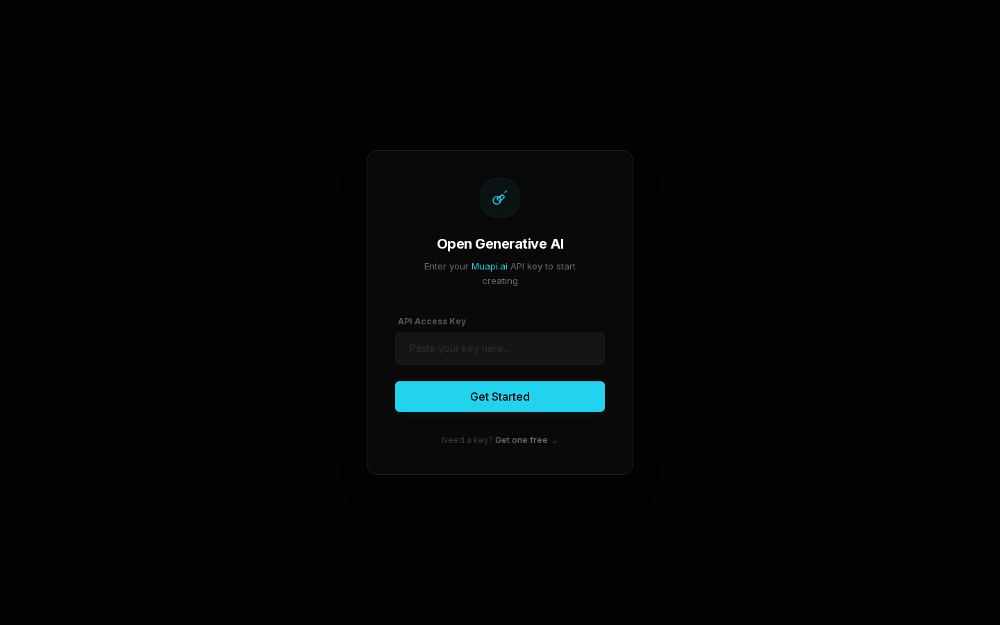
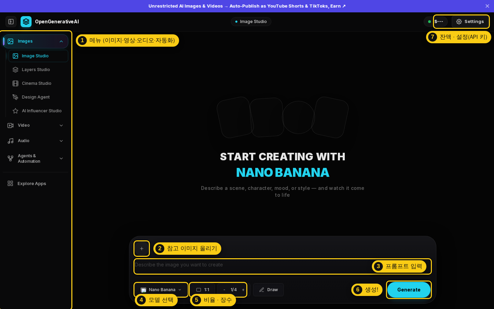
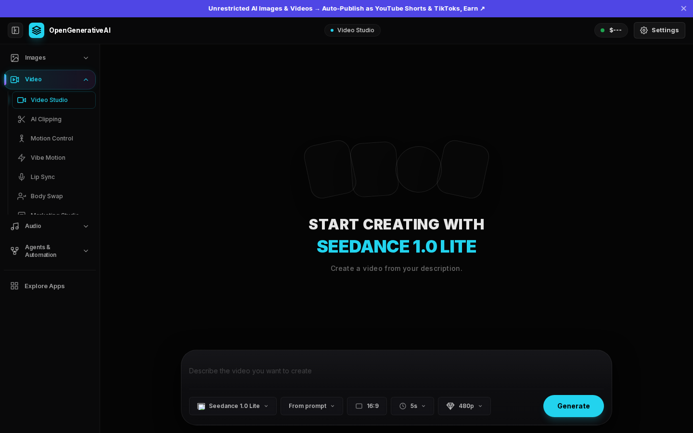
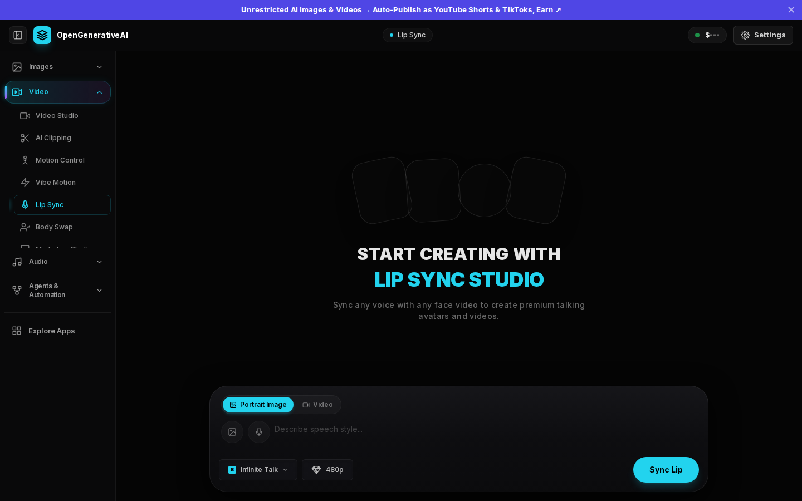

# 🎨 Open Generative AI 설치 가이드

> **한 줄 소개** — 이미지·영상·음악·립싱크 AI 모델 400여 개를 **한 화면에서** 골라 쓰는 무료 오픈소스 AI 스튜디오예요.
>
> 원본: [Anil-matcha/Open-Generative-AI](https://github.com/Anil-matcha/Open-Generative-AI) · MIT 라이선스 · 이 저장소의 `open-generative-ai/` 폴더에 연결(서브모듈)되어 있어요.

---

## 💡 먼저 알아둘 핵심 3가지

1. **앱은 무료지만 생성에는 돈이 들어요.** 앱은 여러 AI 모델을 한곳에서 부르는 **"무료 리모컨"** 이고, 실제 생성은 [Muapi.ai](https://muapi.ai)라는 **"중계소"** 를 거쳐요.
   그래서 **Muapi API 키**가 필요하고, 생성할 때마다 **미리 충전해 둔 잔액(크레딧)** 에서 모델별 요금이 빠져나가요.
2. **완전 무료로 쓰는 방법도 있어요.** 데스크톱 앱의 **로컬 모델** 기능을 쓰면 내 컴퓨터가 직접 이미지를 만들어서 API 키도, 요금도 필요 없어요. (이미지만 되고, 컴퓨터 사양이 필요해요)
3. **설치 방법은 3가지예요.** 대부분은 **B. 데스크톱 앱**이 가장 편해요.

---

## 1. 나에게 맞는 설치 방법 고르기

| 방법 | 이런 분께 | 난이도 | 준비물 |
|---|---|---|---|
| **A. 온라인 버전** | 설치 없이 바로 써보고 싶을 때 | ⭐ | 브라우저 + 회원가입 |
| **B. 데스크톱 앱** ✅ 추천 | 수강생 · 일반 사용자 | ⭐⭐ | 설치 파일 하나 |
| **C. 소스코드 설치** | 화면을 고치거나 직접 운영하고 싶을 때 | ⭐⭐⭐ | Node.js 18 이상, Git |

### A. 온라인 버전 (설치 없음)

[muapi.ai/open-generative-ai](https://muapi.ai/open-generative-ai) 접속 → 회원가입 → 바로 사용.
항상 최신 모델이 반영돼 있어요. 단, **로컬 모델(무료 생성) 기능은 없어요.**

### B. 데스크톱 앱 (추천) — 최신 v2.0.0

| 내 컴퓨터 | 다운로드 |
|---|---|
| Windows | [Open.Generative.AI.Setup.2.0.0.exe](https://github.com/Anil-matcha/Open-Generative-AI/releases/download/v2.0.0/Open.Generative.AI.Setup.2.0.0.exe) |
| Mac (Apple 칩 M1~M4) | [Open.Generative.AI-2.0.0-arm64.dmg](https://github.com/Anil-matcha/Open-Generative-AI/releases/download/v2.0.0/Open.Generative.AI-2.0.0-arm64.dmg) |
| Mac (Intel 칩) | [Open.Generative.AI-2.0.0.dmg](https://github.com/Anil-matcha/Open-Generative-AI/releases/download/v2.0.0/Open.Generative.AI-2.0.0.dmg) |
| Linux (Ubuntu) | [.deb](https://github.com/Anil-matcha/Open-Generative-AI/releases/download/v2.0.0/open-generative-ai_2.0.0_amd64.deb) · [.AppImage](https://github.com/Anil-matcha/Open-Generative-AI/releases/download/v2.0.0/Open.Generative.AI-2.0.0.AppImage) |

> 🍎 **내 Mac 칩 확인법**: 화면 왼쪽 위 사과 메뉴 → **이 Mac에 관하여** → "칩: Apple M…"이면 Apple 칩, "프로세서: Intel…"이면 Intel.

**⚠️ 처음 실행할 때 보안 경고가 떠요 — 정상이에요.** 개발자가 유료 인증서로 서명하지 않은 앱이라서 그래요.

- **Windows**: "Windows의 PC 보호" 창 → **추가 정보** → **실행**
- **Mac**: 앱을 `응용 프로그램` 폴더로 옮기고 한 번 실행 → 막히면 **시스템 설정 → 개인정보 보호 및 보안** → 맨 아래 **그래도 열기(Open Anyway)**
  - 그래도 안 되면 터미널에 한 줄 입력: `xattr -cr "/Applications/Open Generative AI.app"`
- 설치 파일은 **반드시 위 공식 GitHub 링크에서만** 받으세요.

### C. 소스코드로 설치 (이 저장소 기준)

```bash
# 1) 저장소 내려받기 — --recurse-submodules 를 꼭 붙이세요!
git clone --recurse-submodules https://github.com/koliebe25/GenerativeAI.git
cd GenerativeAI

# 2) 설치 (Node 버전 확인 → 원본 코드 받기 → 의존성 설치 + 빌드, 1~3분)
bash scripts/setup-open-generative-ai.sh

# 3) 실행 (둘 중 하나)
cd open-generative-ai
npm run dev            # 웹 버전 → 브라우저에서 http://localhost:3000
npm run electron:dev   # 데스크톱 앱 버전 (로컬 모델 기능 포함)
```

- **Windows**는 스크립트를 **Git Bash**에서 실행하거나, 아래 명령을 직접 입력하세요.
  ```bash
  git submodule update --init --recursive
  cd open-generative-ai
  npm run setup
  ```
- ⏱ `npm run dev`로 켜면 **처음 접속할 때 화면이 뜨기까지 30초~1분** 걸려요 (첫 준비 작업). 두 번째부터는 빨라요. 수업 시연 전에 미리 한 번 열어두세요.
- ⚠️ GitHub에서 **ZIP으로 내려받으면 `open-generative-ai` 폴더가 비어 있어요.** 꼭 `git clone --recurse-submodules`로 받으세요.

---

## 2. 첫 실행 — API 키 넣기



1. [muapi.ai/access-keys](https://muapi.ai/access-keys)에서 가입하고 **키 발급** (발급은 무료)
2. 만들어진 **키 값**을 복사 — ⚠️ 키 "이름"이 아니라 긴 **"값"** 을 복사해야 해요
3. 붙여넣기
   - **웹 버전**: 첫 화면(위 그림)의 **API Access Key** 칸 → **Get Started**
   - **데스크톱 앱**: 처음 **Generate**를 누르면 뜨는 키 입력 창 (또는 **Settings → API Key**)
4. 실제로 생성하려면 Muapi에서 **잔액을 충전**해야 해요. 잔액이 없으면 `Insufficient credits` 오류가 떠요.

> 🔐 키는 **내 브라우저(또는 앱) 안에만 저장**되고, 생성 요청을 보낼 때만 Muapi로 전달돼요.
> 키 바꾸기 · 지우기 — **웹 버전**: 오른쪽 위 **Settings → Change Key** / **데스크톱 앱**: **Settings → API Key**에서 새 키로 저장 (삭제 버튼은 없어요).

---

## 3. 화면 둘러보기

### 웹 버전 — 이미지 스튜디오



| 번호 | 이름 | 하는 일 |
|:-:|---|---|
| 1 | 메뉴 | 4개 묶음(Images · Video · Audio · Agents & Automation) 아래에 스튜디오가 모여 있어요 |
| 2 | 참고 이미지 올리기 | 이미지 → 이미지. 모델에 따라 참고 이미지를 **최대 14장**까지 넣을 수 있어요 |
| 3 | 프롬프트 입력 | 만들고 싶은 장면을 글로 설명 |
| 4 | 모델 선택 | Nano Banana, Flux, Midjourney, Seedream 등 |
| 5 | 비율 · 장수 | 1:1, 16:9 … / 한 번에 1~4장 |
| 6 | 생성 | 누르는 순간 잔액에서 요금이 빠져나가요 |
| 7 | 잔액 · 설정 | 남은 크레딧 확인, API 키 변경 |

**메뉴 한눈에 보기**

| 묶음 | 스튜디오 | 한 줄 설명 |
|---|---|---|
| **Images** | Image Studio | 글 → 이미지, 이미지 → 이미지 |
| | Layers Studio | 이미지 레이어 편집 · 고해상도 업스케일 |
| | Cinema Studio | 카메라 · 렌즈 · 조명을 골라 영화 같은 장면 만들기 |
| | Design Agent | 대화하며 디자인 시안 만들기 |
| | AI Influencer Studio | 가상 인플루언서 캐릭터 만들기 |
| **Video** | Video Studio | 글 → 영상, 이미지 → 영상 |
| | AI Clipping | 긴 영상에서 짧은 클립 뽑기 |
| | Motion Control · Body Swap | 동작 따라 하기 · 영상 속 인물 바꾸기 |
| | Vibe Motion | 글로 설명해서 모션 그래픽 만들기 |
| | Lip Sync | 사진(또는 영상) + 음성 → 말하는 영상 |
| | Marketing Studio | 광고 · 마케팅 콘텐츠 |
| **Audio** | Audio Studio | 음악(Suno 등) · 오디오 생성 |
| **Agents & Automation** | Agents · Workflows | AI 에이전트 · 여러 단계를 이어 붙인 자동화 |

### 웹 버전 — 영상 · 립싱크 스튜디오

| 영상 스튜디오 (모델 · 비율 · 길이 · 해상도 선택) | 립싱크 스튜디오 (사진/영상 + 음성) |
|---|---|
|  |  |

### 데스크톱 앱 — 화면 구성이 조금 달라요


- 메뉴가 **위쪽 가로줄**에 있어요 (Image · Video · Lip Sync · Cinema Studio · Workflows · Agents · MCP & CLI).
- 모델 선택 옆 **☁ API** 버튼을 **⚡ Local**로 바꾸면 로컬 모델(무료)로 생성해요.

> 📷 위 캡처들은 클라우드 테스트 환경에서 찍어서 **샘플 이미지와 잔액이 비어 보여요**. 내 컴퓨터에서는 정상적으로 보여요.

---

## 4. 무료로 쓰기 — 로컬 모델 (데스크톱 앱 전용)

1. **Settings → Local Models**
2. **sd.cpp 엔진 설치** (클릭 한 번, 자동 다운로드)
3. 원하는 **모델 다운로드**
4. Image Studio에서 **⚡ Local**로 바꾸고 생성 → API 키 필요 없음

| 모델 | 용량 | 특징 | 권장 사양 |
|---|---|---|---|
| **Dreamshaper 8** | 2.1GB | 만능형, 가장 가벼움 | 램 8GB Mac도 OK |
| Realistic Vision v5.1 | 2.1GB | 실사 사진풍 | 램 8GB 이상 |
| Anything v5 | 2.1GB | 애니 · 일러스트 | 램 8GB 이상 |
| SDXL Base 1.0 | 6.9GB | 고해상도 | 램 16GB 권장 |
| Z-Image Turbo / Base | 2.5~3.5GB + 보조 파일 2.7GB | 고품질 | **램 16GB 권장** (8GB Mac은 멈출 수 있어요) |

> - Apple 칩 Mac은 GPU(Metal)로 빠르게 돌아가요. Windows/Linux는 NVIDIA 등 GPU가 있으면 빨라요.
> - **영상 로컬 생성(Wan2GP)** 은 NVIDIA/AMD GPU가 달린 별도 서버가 필요해서 수업용으로는 추천하지 않아요.
> - 모델 저장 위치 — Mac: `~/Library/Application Support/open-generative-ai/local-ai` · Windows: `%APPDATA%\open-generative-ai\local-ai`

---

## 5. 자주 막히는 곳

| 증상 | 해결 |
|---|---|
| `open-generative-ai` 폴더가 비어 있어요 | `git submodule update --init --recursive` |
| `npm install` 했는데 실행이 안 돼요 | `npm install`만으론 부족해요 → **`npm run setup`** |
| `Couldn't find a 'pages' directory` | `open-generative-ai` 폴더 **안에서** 실행했는지 확인 → `npm run setup` 다시 |
| Node 버전 오류 | Node.js **18 이상** 설치 ([nodejs.org](https://nodejs.org) LTS) |
| `Insufficient credits` | Muapi 잔액 충전 |
| Mac "손상되었기 때문에 열 수 없습니다" | `xattr -cr "/Applications/Open Generative AI.app"` |
| Ubuntu 24.04에서 앱이 바로 꺼져요 | AppImage 대신 **.deb**로 설치 |

---

## 6. ⚠️ 수업 전에 꼭 알아둘 것

- **콘텐츠 필터가 없어요.** 원본은 "필터 없음"을 장점으로 내세우지만, 수업에서는 그만큼 **사용 규칙이 꼭 필요**해요.
  특히 **Lip Sync · Body Swap · AI Influencer**에 실존 인물 사진을 쓰면 **초상권 침해 · 딥페이크** 문제가 생길 수 있어요.
  → 예) "본인 사진이나 AI로 만든 가상 인물만 사용", "타인 · 연예인 · 수강생 얼굴 사용 금지"
  → 성적 딥페이크는 **만드는 것뿐 아니라 소지 · 시청도 처벌 대상**이에요 (성폭력처벌법).
- **API 키 = 내 지갑이에요.** 수강생과 공유하지 말고, 화면 공유 · 슬라이드에 노출되지 않게 하세요. 공용 PC에서는 다 쓰고 키를 꼭 지우세요.
  → 웹 버전: **Settings → Change Key** / 데스크톱 앱: 삭제 버튼이 없어서 **Settings → API Key**에 아무 글자나 넣고 저장해 덮어쓰기
- **영상은 이미지보다 훨씬 비싸요.** 해상도 · 길이 · 오디오 옵션을 올리면 요금도 올라가요. 시연 전에 모델별 가격을 Muapi에서 확인하세요.
- **보안 경고**: 설치 중 `npm audit` 경고 36건(치명 2건: Next.js 등)이 떠요. **내 컴퓨터에서만(localhost) 쓰면 괜찮지만**, 인터넷에 공개 서버로 올릴 때는 원본을 최신으로 업데이트한 뒤 올리세요.
- **화면 언어**: 영어 · 중국어만 지원해요 (한국어 없음).

---

## 7. 업데이트 방법 (소스코드 설치 시)

```bash
git submodule update --remote open-generative-ai   # 원본 최신 버전 받기
cd open-generative-ai && npm run setup              # 하위 모듈 맞추기 + 다시 설치
```

업데이트 후 저장소에 기록하려면 맨 위 폴더에서 `git add open-generative-ai && git commit -m "Update open-generative-ai"`.

---

## 📋 설치 검증 기록 (2026-09-28)

| 항목 | 결과 |
|---|---|
| 원본 버전 | `9d939bc` (v2.0.0 이후 최신 main) |
| `npm run setup` | ✅ 1분 14초 · 패키지 1,044개 · 내부 패키지 4개 빌드 성공 |
| `npm run build` (웹 버전) | ✅ 1분 6초 · 오류 없음 |
| 웹 화면 확인 (`npm run start`) | ✅ 이미지 · 영상 · 립싱크 · 시네마 · 워크플로 화면 모두 정상 |
| 설치 스크립트 (새로 복제한 폴더에서) | ✅ 1분 12초 · 빈 `open-generative-ai` 폴더부터 설치 완료 |
| `npm run dev` | ✅ 첫 화면 준비 약 40초 후 정상 |
| 데스크톱 앱 (Vite 빌드 + Electron 33) | ✅ 창 정상 실행 |
| 실제 생성 테스트 | ⏸ 미실시 — 테스트한 클라우드 환경에서 muapi.ai 접속이 막혀 있었어요. 내 컴퓨터에서 API 키를 넣고 확인하세요 |
| 테스트 환경 | Linux · Node 22 · npm 10 |
