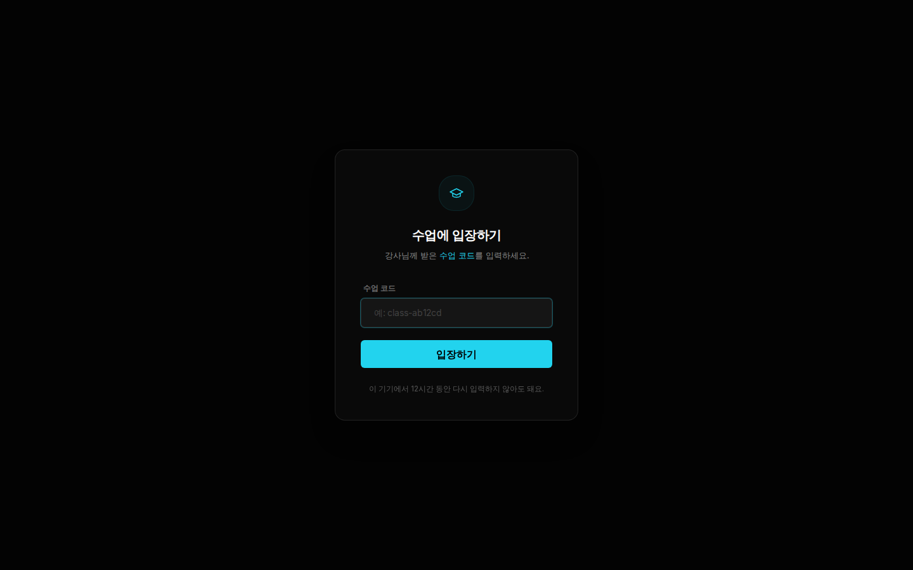
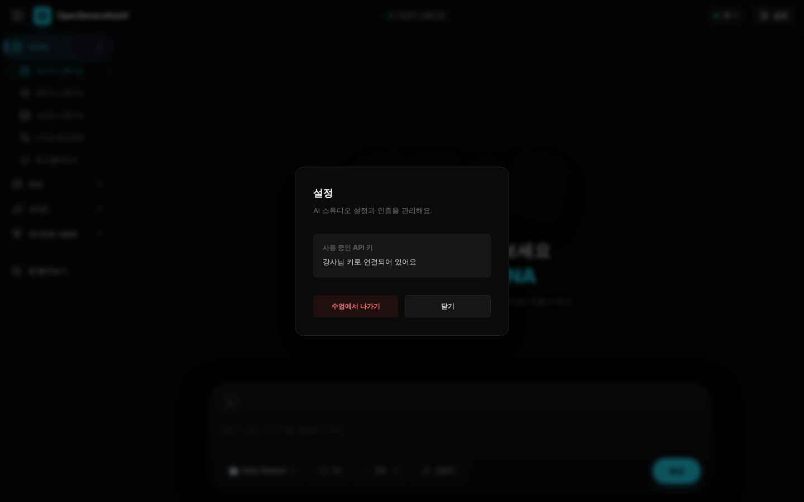
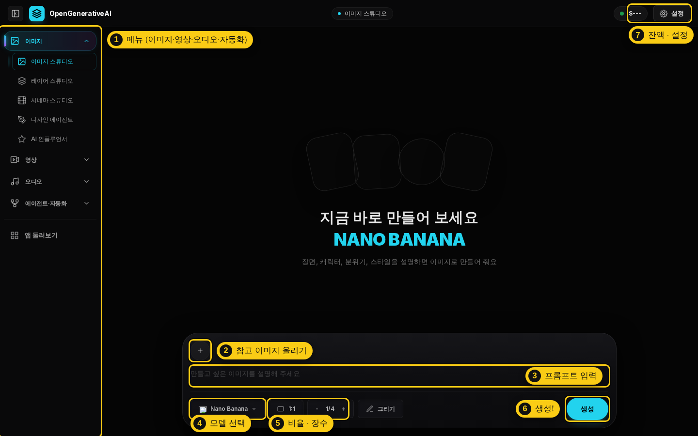
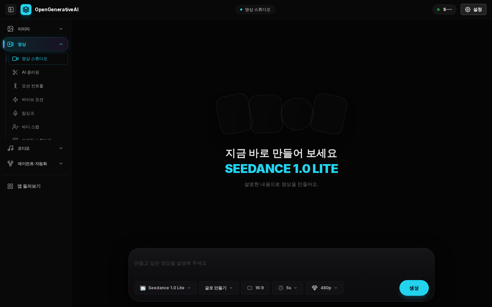
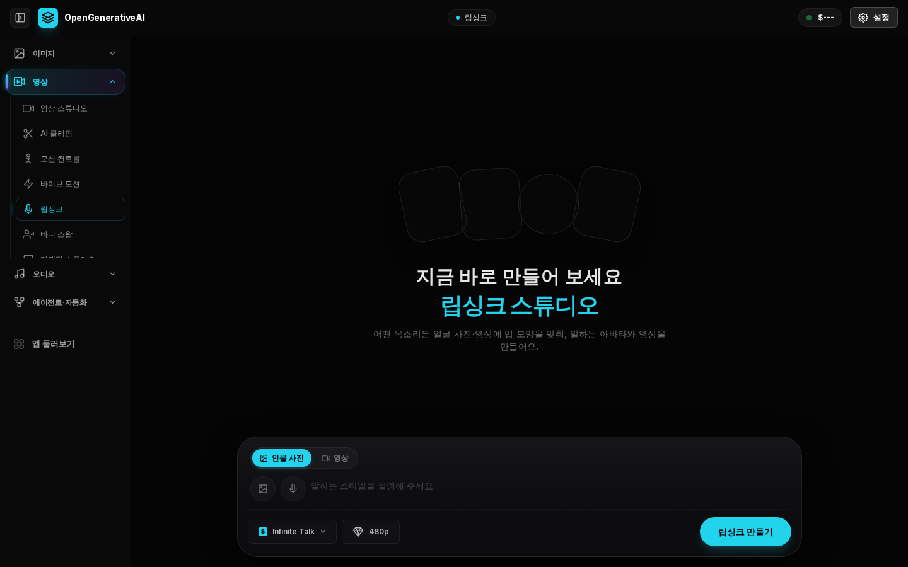
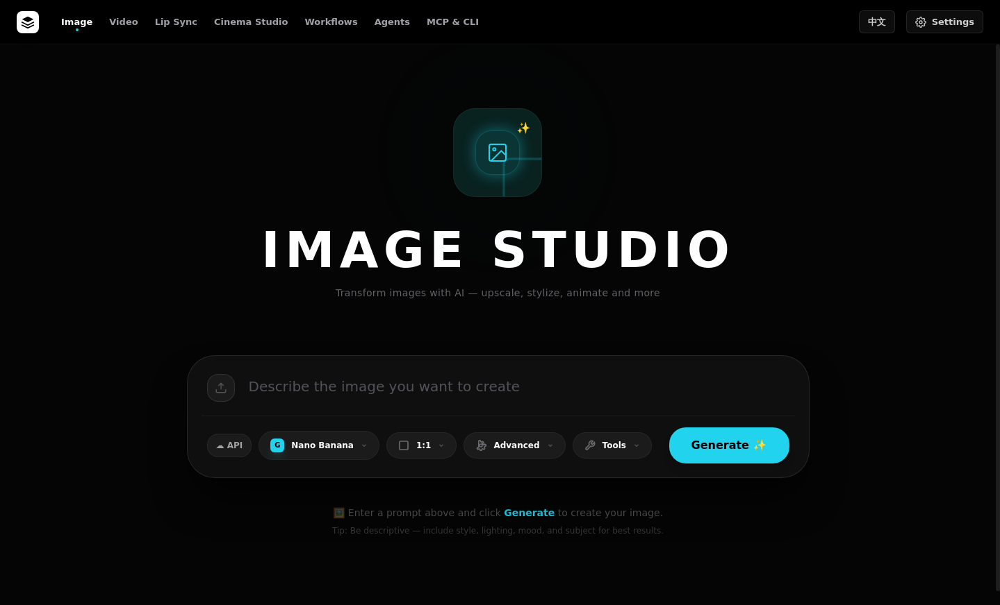

# 🎨 Open Generative AI — 한국어 수업용 버전

> **한 줄 소개** — 이미지·영상·음악·립싱크 AI 모델 400여 개를 **한 화면에서** 골라 쓰는 무료 오픈소스 AI 스튜디오예요.
>
> 원본: [Anil-matcha/Open-Generative-AI](https://github.com/Anil-matcha/Open-Generative-AI) (MIT 라이선스)
> 이 저장소의 `open-generative-ai/` 폴더에 원본 코드를 복사해 두고, **한국어 화면**과 **수업 모드**(강사 키 + 수업 코드)를 더했어요.

---

## 🚀 수업용 사이트 — 설치 없이 링크로

| 항목 | 내용 |
|---|---|
| 사이트 주소 | **[open-generative-ai-ko.vercel.app](https://open-generative-ai-ko.vercel.app)** |
| 수강생 안내문 (Windows) | [student-guide.md](student-guide.md) — 인쇄하거나 링크로 나눠 주세요 |
| 수업 코드 | 강사님이 정해서 아래 1단계에서 등록 (예: `class-` + 영문·숫자 6자리) · **문서·SNS에 공개하지 마세요** |

### ✅ 강사님이 딱 한 번 할 일 (5분)

보안 때문에 **키와 수업 코드는 Vercel 설정 화면에 강사님이 직접** 넣어야 해요. (Claude의 Vercel 연결 권한으로는 환경변수를 등록할 수 없어요.)

1. [Vercel 환경변수 설정 페이지](https://vercel.com/koliebe25-2569s-projects/open-generative-ai-ko/settings/environment-variables) 열기
2. 아래 2개를 추가하고 **Save** (Environments는 **Production** 체크)

   | Key | Value |
   |---|---|
   | `CLASS_PASSCODE` | 학생들에게 알려줄 수업 코드 (예: `class-` + 영문·숫자 6자리) |
   | `MUAPI_API_KEY` | [Muapi](https://muapi.ai/access-keys)에서 발급받은 **키 값** (**Sensitive** 켜기 추천) |

3. **Deployments** 탭 → 맨 위 배포 오른쪽 **⋯** → **Redeploy**
4. **시크릿 창**(크롬 `Ctrl+Shift+N`)으로 사이트 접속 → Vercel 로그인 없이 **수업에 입장하기** 화면이 뜨는지 확인 → 수업 코드 입력 → 이미지 1장 만들어서 확인

> 두 값을 넣기 전에는 수업 코드 없이 열리고, 접속한 사람이 각자 API 키를 넣어야 하는 **일반 모드**로 동작해요.
> `MUAPI_API_KEY`만 넣고 `CLASS_PASSCODE`를 빼면 **일부러 강사 키를 쓰지 않아요** — 링크만 알면 누구나 강사님 크레딧을 쓰게 되는 걸 막기 위해서예요.

### 🔐 수업 모드는 이렇게 동작해요

```
학생 브라우저 ──(수업 코드 확인)──▶ 우리 사이트(Vercel 서버) ──(강사 키를 여기서 붙임)──▶ Muapi AI 모델
```

- **강사 키는 Vercel 서버에만** 있어요. 학생 브라우저·화면·저장소 어디에도 전달되지 않아요. (테스트로 확인)
- 수업 코드를 모르면 **화면도 API도 막혀요**. 한 번 입장하면 그 기기에서 12시간 유지돼요.
- 생성 기록은 **학생 각자 브라우저에만** 저장돼요. 서로의 결과물이나 강사님 기록은 보이지 않아요.
- 설정 화면에는 "강사님 키로 연결되어 있어요"와 **수업에서 나가기** 버튼만 보여요.

| 수업 입장 화면 | 설정 (수업 모드) |
|---|---|
|  |  |

### 💡 수업 운영 팁

- **수업이 끝나면** `CLASS_PASSCODE`를 바꾸고 Redeploy → 모든 학생이 자동으로 로그아웃돼요.
- Muapi는 **선불 충전**이라, 수업에 필요한 만큼만 충전하면 그 이상은 절대 안 빠져나가요 (자동 상한).
- **영상 모델은 이미지보다 훨씬 비싸요.** 수업 전에 쓸 모델의 가격을 Muapi에서 확인하세요.
- **업로드 한도(웹 버전)**: 사진은 4MB가 넘으면 자동으로 줄여서 올라가요. 영상·음성은 4MB 이하만 돼요. (Vercel 서버의 요청 크기 제한 때문)
- 웹 버전에는 **로컬 모델(무료 생성)이 없어요.** 무료 생성은 데스크톱 앱에서만 돼요.
- 이 저장소의 **main 브랜치에 코드가 합쳐지면**(PR merge) 그다음부터는 main에 올리는 변경이 사이트에 자동 반영돼요.

### ⚠️ Vercel 무료(Hobby) 플랜 주의

Hobby 플랜은 **비상업적 개인 용도**로 제한돼요. 수강료를 받는 강의에 쓰신다면 Pro 플랜이 필요할 수 있어요.

---

## 1. 화면 둘러보기 (한국어)



| 번호 | 이름 | 하는 일 |
|:-:|---|---|
| 1 | 메뉴 | 이미지 · 영상 · 오디오 · 에이전트·자동화 4개 묶음 |
| 2 | 참고 이미지 올리기 | 이미지 → 이미지. 모델에 따라 **최대 14장** |
| 3 | 프롬프트 입력 | 만들고 싶은 장면을 글로 설명 |
| 4 | 모델 선택 | Nano Banana, Flux, Midjourney, Seedream 등 |
| 5 | 비율 · 장수 | 1:1, 16:9 … / 한 번에 1~4장 |
| 6 | 생성 | 누르는 순간 잔액에서 요금이 빠져나가요 |
| 7 | 잔액 · 설정 | 남은 크레딧 확인, (수업 모드) 수업에서 나가기 |

**메뉴 한눈에 보기**

| 묶음 | 스튜디오 | 한 줄 설명 |
|---|---|---|
| **이미지** | 이미지 스튜디오 | 글 → 이미지, 이미지 → 이미지 |
| | 레이어 스튜디오 | 레이어 분리 · 업스케일 · 색보정 · 배경 제거 |
| | 시네마 스튜디오 | 카메라 · 렌즈 · 조명을 골라 영화 같은 장면 |
| | 디자인 에이전트 | 대화하며 디자인 시안 만들기 |
| | AI 인플루언서 | 가상 인플루언서 캐릭터 만들기 |
| **영상** | 영상 스튜디오 | 글 → 영상, 이미지 → 영상 |
| | AI 클리핑 | 긴 영상에서 하이라이트 클립 뽑기 |
| | 모션 컨트롤 · 바디 스왑 | 동작 따라 하기 · 영상 속 인물 바꾸기 |
| | 바이브 모션 | 글로 설명해서 모션 그래픽 만들기 |
| | 립싱크 | 사진(또는 영상) + 음성 → 말하는 영상 |
| | 마케팅 스튜디오 | 제품 광고 영상 |
| **오디오** | 오디오 스튜디오 | 음악(Suno 등) · 오디오 생성 |
| **에이전트·자동화** | 에이전트 · 워크플로 | AI 에이전트 · 여러 단계를 이어 붙인 자동화 |

| 영상 스튜디오 | 립싱크 스튜디오 |
|---|---|
|  |  |

> 📷 캡처는 테스트 환경에서 찍어서 **샘플 이미지와 잔액이 비어 보여요**.
> 모델 이름, 모델별 세부 옵션 일부, 워크플로·에이전트·디자인 에이전트의 세부 화면은 **영어 그대로**예요.

---

## 2. 다른 설치 방법 (필요할 때만)

| 방법 | 이런 분께 | 준비물 |
|---|---|---|
| **A. 원본 온라인 버전** | 개인적으로 바로 써보고 싶을 때 | [muapi.ai/open-generative-ai](https://muapi.ai/open-generative-ai) 회원가입 (영어 화면) |
| **B. 데스크톱 앱** | 로컬 모델로 **무료** 생성까지 해 보고 싶을 때 | 설치 파일 (영어·중국어 화면) |
| **C. 내 PC에서 소스코드로 실행** | 한국어 버전을 내 PC에서 돌려보고 싶을 때 | Node.js 18 이상, Git |

### B. 데스크톱 앱 — 원본 v2.0.0

| 내 컴퓨터 | 다운로드 |
|---|---|
| Windows | [Open.Generative.AI.Setup.2.0.0.exe](https://github.com/Anil-matcha/Open-Generative-AI/releases/download/v2.0.0/Open.Generative.AI.Setup.2.0.0.exe) |
| Mac (Apple 칩 M1~M4) | [Open.Generative.AI-2.0.0-arm64.dmg](https://github.com/Anil-matcha/Open-Generative-AI/releases/download/v2.0.0/Open.Generative.AI-2.0.0-arm64.dmg) |
| Mac (Intel 칩) | [Open.Generative.AI-2.0.0.dmg](https://github.com/Anil-matcha/Open-Generative-AI/releases/download/v2.0.0/Open.Generative.AI-2.0.0.dmg) |



- 메뉴가 위쪽 가로줄에 있고, 모델 선택 옆 **☁ API** 버튼을 **⚡ Local**로 바꾸면 로컬 모델로 생성해요.
- **Windows 보안 경고**: "Windows의 PC 보호" 창 → **추가 정보** → **실행** (서명 안 된 앱이라 뜨는 정상 경고)
- **Mac 보안 경고**: 시스템 설정 → 개인정보 보호 및 보안 → **그래도 열기** / 안 되면 터미널에 `xattr -cr "/Applications/Open Generative AI.app"`
- 데스크톱 앱은 **첫 Generate를 누를 때** API 키를 물어봐요. 키 삭제 버튼이 없어서, 공용 PC에서는 **Settings → API Key**에 아무 글자나 넣고 저장해 덮어쓰세요.

**무료 로컬 모델 (데스크톱 앱 전용)**: Settings → Local Models → sd.cpp 엔진 설치 → 모델 다운로드 → 이미지 스튜디오에서 **⚡ Local**
| 모델 | 용량 | 권장 사양 |
|---|---|---|
| Dreamshaper 8 (만능형) | 2.1GB | 램 8GB Mac도 OK |
| Realistic Vision v5.1 (실사) · Anything v5 (애니) | 각 2.1GB | 램 8GB 이상 |
| SDXL Base 1.0 (고해상도) | 6.9GB | 램 16GB 권장 |
| Z-Image Turbo / Base (고품질) | 2.5~3.5GB + 보조 2.7GB | 램 16GB 권장 (8GB Mac은 멈출 수 있어요) |

### C. 내 PC에서 한국어 버전 실행

```bash
git clone https://github.com/koliebe25/GenerativeAI.git   # 또는 GitHub에서 ZIP 다운로드 후 압축 풀기
cd GenerativeAI
bash scripts/setup-open-generative-ai.sh                   # Windows는 Git Bash에서 (1~3분)
cd open-generative-ai
npm run dev                                                # 브라우저에서 http://localhost:3000 → 한국어 화면
```

- 처음 접속할 때 화면이 뜨기까지 **30초~1분** 걸려요 (첫 준비 작업). 두 번째부터는 빨라요.
- 내 PC에서도 수업 모드를 쓰려면 실행 전에 환경변수를 넣어요: `CLASS_PASSCODE=... MUAPI_API_KEY=... npm run dev`

---

## 3. 자주 막히는 곳

| 증상 | 해결 |
|---|---|
| 수업 코드를 넣어도 계속 입장 화면 | 코드를 바꿨다면 Redeploy 했는지 확인 · 브라우저가 쿠키를 막는지 확인 |
| 수업 코드 없이 바로 열려요 | Vercel에 `CLASS_PASSCODE`를 넣고 **Redeploy** 했는지 확인 |
| 학생 화면에 API 키 입력창이 떠요 | `MUAPI_API_KEY`를 넣고 **Redeploy** 했는지 확인 |
| `Insufficient credits` | Muapi 잔액 충전 |
| 업로드가 안 돼요 | 영상·음성은 4MB 이하로 (사진은 자동 축소) |
| `npm install` 했는데 실행이 안 돼요 | `npm install`만으론 부족해요 → `npm run setup` |
| Node 버전 오류 | Node.js **18 이상** ([nodejs.org](https://nodejs.org) LTS) |

---

## 4. ⚠️ 수업 전에 꼭 알아둘 것

- **콘텐츠 필터가 없어요.** 원본은 "필터 없음"을 장점으로 내세우지만, 수업에서는 그만큼 **사용 규칙이 꼭 필요**해요.
  특히 **립싱크 · 바디 스왑 · AI 인플루언서**에 실존 인물 사진을 쓰면 **초상권 침해 · 딥페이크** 문제가 생길 수 있어요.
  → 예) "본인 사진이나 AI로 만든 가상 인물만", "타인 · 연예인 · 수강생 얼굴 금지"
  → 성적 딥페이크는 **만드는 것뿐 아니라 소지 · 시청도 처벌 대상**이에요 (성폭력처벌법).
- **강사 키 = 강사님 지갑이에요.** 수업 모드에서는 키가 학생에게 보이지 않지만, 수업 코드가 새면 누구나 쓸 수 있어요. 코드는 수업마다 바꾸세요.
- **보안 업데이트**: 원본이 쓰던 Next.js 15.5.15에는 공개 서버에 위험한 취약점(접근 제한 우회, 원격 코드 실행 등)이 있어서 **15.5.26으로 올렸어요.** 남은 `npm audit` 경고는 빌드 도구(postcss, tar) 쪽이라 배포된 사이트에는 영향이 없어요.

---

## 5. 원본과 달라진 점

| 변경 | 파일 |
|---|---|
| 한국어 화면 (공통 + 스튜디오 15개, 957문장) · `/`를 `/ko/studio`로 연결 | `messages/ko/`, `packages/studio/src/messages/ko/`, `lib/locales.js`, `app/ko/` |
| 수업 모드 (강사 키를 서버에서만 사용 + 수업 코드 입장) | `lib/classAccess.js`, `middleware.js`, `app/class-login/`, `app/api/class-login/` |
| 큰 사진 자동 축소 · 너무 큰 파일 안내 | `packages/studio/src/muapi.js` |
| Next.js 15.5.26 보안 업데이트 | `package.json`, `package-lock.json` |
| Vercel 빌드 설정 | `vercel.json` |

원본 버전(복사 시점): Open-Generative-AI `9d939bc` · Vibe-Workflow `c65ce89` · Open-Poe-AI `3e21ebc` · Open-AI-Design-Agent `ebc0ce7`
원본의 새 기능을 가져오고 싶으면 Claude에게 **"Open Generative AI 원본 업데이트 반영해줘"** 라고 요청하세요.

---

## 📋 검증 기록 (2026-09-28)

| 항목 | 결과 |
|---|---|
| 한국어 번역 | ✅ 957문장, 빠진 항목 0개, `{자리표시자}` 불일치 0개 |
| 빌드 (`npm run build`, Next.js 15.5.26) | ✅ 오류 없음 |
| 수업 모드 | ✅ 코드 없이 접속 → 입장 화면 / 틀린 코드 거부 / 위조 쿠키 거부 / API 직접 호출 차단 |
| 강사 키 보호 | ✅ 서버에서 키 자동 첨부 · 페이지·빌드 파일·브라우저 저장소에 키 없음 · 학생이 보낸 키는 무시 |
| 사진 자동 축소 | ✅ 11.6MB → 2.5MB, 17.1MB PNG → 3.0MB, 작은 사진은 그대로 |
| Vercel 배포 | ✅ open-generative-ai-ko.vercel.app (Next.js 15.5.26, 빌드 약 4분) · 한국어 페이지 응답 확인 · 강사님 환경변수 설정 전이라 현재는 일반 모드 |
| 실제 생성 | ⏸ 테스트 환경에서 muapi.ai 접속이 막혀 있어 미확인 — 강사님 키를 넣은 뒤 이미지 1장으로 확인해 주세요 |
