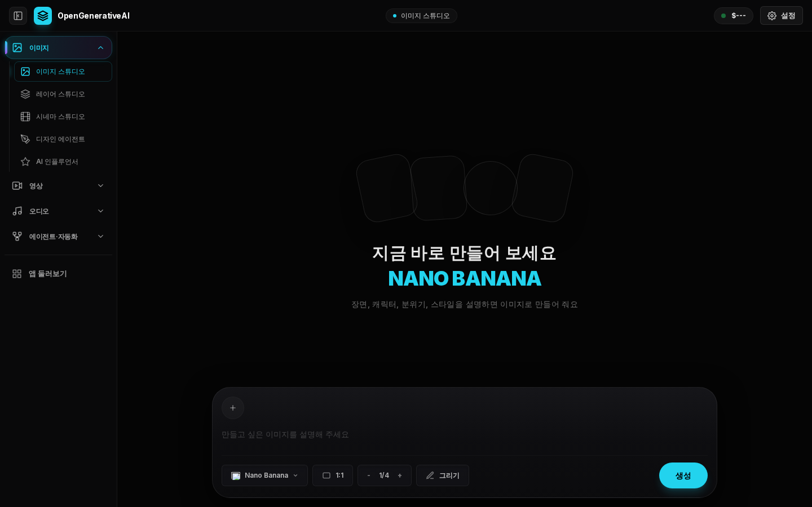

# 🎨 AI 스튜디오 사용 안내 (수강생용)

> **준비물**: 인터넷이 되는 **Windows PC** + **크롬(Chrome)** 또는 **엣지(Edge)** 브라우저
> 설치할 프로그램은 없어요. 링크만 열면 바로 써요.

---

## 1. 입장하기 (1분)

1. 크롬 또는 엣지를 열어요.
2. 주소창에 **[open-generative-ai-ko.vercel.app](https://open-generative-ai-ko.vercel.app)** 를 입력하고 `Enter`
3. **수업에 입장하기** 화면이 나오면, 강사님이 알려준 **수업 코드**를 입력하고 **입장하기**
   - 한 번 입력하면 이 PC에서는 12시간 동안 다시 묻지 않아요.

---

## 2. 이미지 만들기

1. 왼쪽 메뉴 **이미지 → 이미지 스튜디오**
2. 아래 입력칸에 만들고 싶은 장면을 적어요.
   - 예) `비 오는 밤 서울 골목의 네온사인 카페, 시네마틱, 35mm 필름 느낌`
3. **모델**(예: Nano Banana)과 **비율**(1:1, 16:9 …)을 고르고 **생성**
4. 완성된 이미지에 마우스를 올리면 **다운로드** 버튼이 나와요.

---

## 3. 영상 만들기

1. 왼쪽 메뉴 **영상 → 영상 스튜디오**
2. **글로 만들기** 또는 **이미지 움직이기**를 고르고, 장면을 설명한 뒤 **생성**
3. 영상은 몇 분 걸려요. 기다리는 동안 다른 메뉴를 봐도 돼요. 다 되면 알림이 떠요.

---

## 4. 사진을 올려서 만들기

- 입력칸 왼쪽의 **+** 버튼 → 사진 선택
- **4MB가 넘는 사진은 자동으로 줄여서** 올라가요.
- **영상·음성 파일은 4MB 이하만** 올릴 수 있어요. (휴대폰으로 찍은 긴 영상은 잘라서 올려 주세요)

---

## 5. ⚠️ 꼭 지켜 주세요

- ❌ **실존 인물**(연예인·친구·가족·수강생) 사진으로 얼굴 바꾸기, 립싱크, 바디 스왑 금지
- ❌ 성적인 이미지, 타인을 흉내 내는 딥페이크 금지 — **만들거나 갖고 있기만 해도 처벌**받을 수 있어요
- ❌ **수업 코드는 수업 참가자끼리만** — SNS·단톡방 공유 금지
- 💰 생성할 때마다 **강사님 크레딧**이 쓰여요. 특히 **영상은 비싸요** → 계획을 세우고 꼭 필요한 만큼만
- 💾 결과물은 바로 **다운로드**해 두세요. 기록은 이 브라우저에만 남아서 공용 PC에서는 사라질 수 있어요.

---

## 6. 이럴 땐 이렇게

| 이럴 땐 | 이렇게 해 보세요 |
|---|---|
| "수업 코드가 맞지 않아요" | 띄어쓰기 없이 정확히 입력 (예: `class-ab12cd`) |
| 화면이 멈췄어요 | `F5`(새로고침) |
| 업로드가 안 돼요 | 파일이 4MB를 넘는지 확인 (영상·음성은 줄여서 다시) |
| `Insufficient credits` 오류 | 강사님께 알려 주세요 (크레딧 부족) |
| 영어가 조금 보여요 | 모델 이름과 일부 세부 설정은 영어 그대로예요 |
