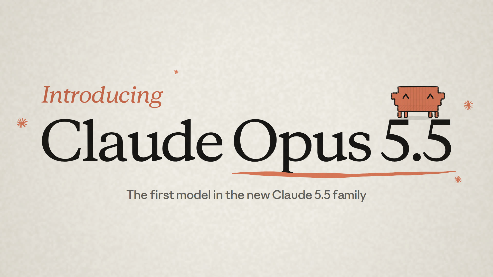

# Introducing Claude Opus 5.5 — a hand-drawn launch film, made entirely in code



**▶ [`Introducing-Claude-Opus-5.5.mp4`](Introducing-Claude-Opus-5.5.mp4)** — 30 s · 1920×1080 · 30 fps · H.264 + AAC · 6.9 MB

An unofficial 30-second launch film for Claude Opus 5.5. Every frame is drawn by JavaScript
on an HTML canvas in a hand-inked style: wobbly pen lines, riso-style fills and 10 fps line
"boil". Clawd, the 8-bit mascot from Claude Code, is the hero. The chiptune score and every
sound effect are synthesized with numpy. There's no video model, stock footage, skill or MCP
server in the pipeline.

## 한눈에 보기 (Korean summary)

| | |
|---|---|
| 형식 | MP4 (H.264 + AAC), 1920×1080, 30fps, 정확히 30초, 6.9MB |
| 제작 방식 | 코드만 사용. 캔버스 손그림 애니메이션 + 파이썬으로 합성한 8비트 음악·효과음 |
| 주인공 | Clawd. Claude Code CLI가 터미널에 찍는 블록 문자(▐▛███▛█)를 그대로 해독해 만든 8비트 캐릭터 |
| 브랜딩 | 실제 Claude 로고(claude.com SVG), Anthropic Serif/Sans/Mono 서체, anthropic.com 공식 색상 |
| 수치 | 모두 Anthropic 공식 발표 페이지(2026-09-22) 기준. 아래 표 참고 |

**구성**: 스파크 로고가 그려지고 Clawd가 태어남 → 타이틀 → *Builds.*(코딩) → *Works.*(지식 노동)
→ *Draws.*(이 영상 자체가 코드라는 반전) → 엔드 카드

## Storyboard

| # | Time | Shot | Figure on screen (source: anthropic.com/claude-opus-5-5) |
|---|---|---|---|
| 1 | 0.0–2.5 | A pencil sketches the real Claude spark; it's inked, filled, spun, and shatters. Clawd materialises pixel by pixel | — |
| 2 | 2.5–5.0 | Title slam. Clawd lands on the "5.5" | "the first model in our new Claude 5.5 family" |
| 3 | 5.0–7.0 | Price tag stamp + speedometer | performs at the level of Fable 5.1 on most work · **40% less** to run than Opus 5 · output **30%+ faster** |
| 4 | 7.0–7.75 | Chapter card **01 Builds.** — hard hat drops | — |
| 5 | 7.75–9.75 | Clawd juggles code from `legacy/` into `new/` | **680,000-line** code migration in under a day |
| 6 | 9.75–11.75 | Clawd rides the winning bar and plants a spark flag | Terminal-Bench 4.0 **66.4%** (GPT-6 Astra 57.9 · Fable 5.1 55.8 · Opus 5 52.3) |
| 7 | 11.75–13.75 | Clawd conducts 12 mini-Clawds; 40 PRs tick green | "one Opus 5.5 session directed a dozen more" · **40/40** stacked PRs passed CI |
| 8 | 13.75–14.5 | Chapter card **02 Works.** — tie & glasses | — |
| 9 | 14.5–16.5 | Hat-swap montage inside a ring of 44 occupations | GDPval-AA v2.1 **1846 Elo** (Fable 5.1 1735 · Opus 5 1708) |
| 10 | 16.5–18.5 | A spreadsheet folds into an exec deck | merger model + deck in **63 min** vs 93 for Opus 5, at 50% less cost |
| 11 | 18.5–20.5 | Detective Clawd fact-checks 18 reports | **16 of 18** reports with no invented figures; Fable 5.1 & Opus 5 cleared the bar in no attempt |
| 12 | 20.5–22.25 | Clawd surfs a mouse cursor across a desktop | OSWorld 2.0 **81.8%** (partial credit; Fable 5.1 80.7%) |
| 13 | 22.25–26.25 | **03 Draws.** — the film zooms out into its own storyboard, then into its own source code | "1 prompt · 0 video models · 0 stock footage · N lines of JS" (N is counted live from `src/`) |
| 14 | 26.25–30.0 | Official Claude lockup, **Opus 5.5**, "Available now on all platforms", `claude-opus-5-5` | — |

## How it's made

```
src/*.js (canvas, pure function of time t)  ──►  headless Chromium × 4 workers ──► 900 PNG frames ─┐
      │ window.CUES (50 timed sound cues)                                                          ├─► ffmpeg (x264 -tune animation) ─► MP4
      └──► scripts/soundtrack.py (numpy synth: pulse/triangle/noise + foley) ──► soundtrack.wav ────┘
```

| File | What it does |
|---|---|
| `src/engine.js` | Hand-drawn primitives: variable-width ink strokes, wobble, hatching, riso fills, paper, per-glyph type animation |
| `src/clawd.js` | Clawd decoded from Claude Code's quadrant block characters (4 official poses + 2 remixed ones), plus hats and props |
| `src/brand.js` | The real Claude spark and wordmark (SVG paths): trace-on, marker fill, spin, shatter-into-rays |
| `src/scenes.js` | 14 shots, 13 transitions (whip, zoom punch, page flip, brush wipe, hard cut), sound cues |
| `scripts/render.mjs` | Deterministic frame renderer and encoder (`--stills`, `--sheet`, `--cues`) |
| `scripts/soundtrack.py` | 120 BPM chiptune in C → D major plus about 40 synthesized sound effects, mastered to about −14 LUFS |

### Rebuild

```bash
npm install                  # playwright-core (uses a local Chromium)
pip install numpy scipy imageio-ffmpeg
npm run fetch-assets         # downloads Anthropic Sans/Serif/Mono into fonts/ (not committed)
npm run build                # cues → soundtrack.wav → 900 frames → MP4 (≈ 3 min on 4 cores)
# live preview: serve the folder and open src/index.html?play   (space = pause, ←/→ = seek)
```

## Asset provenance

- **Claude spark + wordmark**: the vector paths of the logo lockup served on claude.com (`src/assets.js`).
- **Clawd**: the pose table (`default`, `look-left`, `look-right`, `arms-up`) and colour `rgb(215,119,87)` as rendered
  by the Claude Code CLI (v2.1). Each terminal quadrant becomes one 1×2 "pixel".
- **Palette**: Anthropic's CSS swatches (clay `#D97757`, ivory `#FAF9F5`/`#F0EEE6`, slate `#141413`, oat, olive, sky, fig, heather…).
- **Type**: Anthropic Serif, Sans and Mono (© Anthropic PBC). They are proprietary, so they are fetched for local rendering and not redistributed here.

> Unofficial fan film. Not affiliated with or endorsed by Anthropic. Claude and the Claude logo are trademarks of Anthropic PBC.
> All figures are quoted from Anthropic's Opus 5.5 announcement (Sept 22, 2026). Benchmark scores are as reported there.
